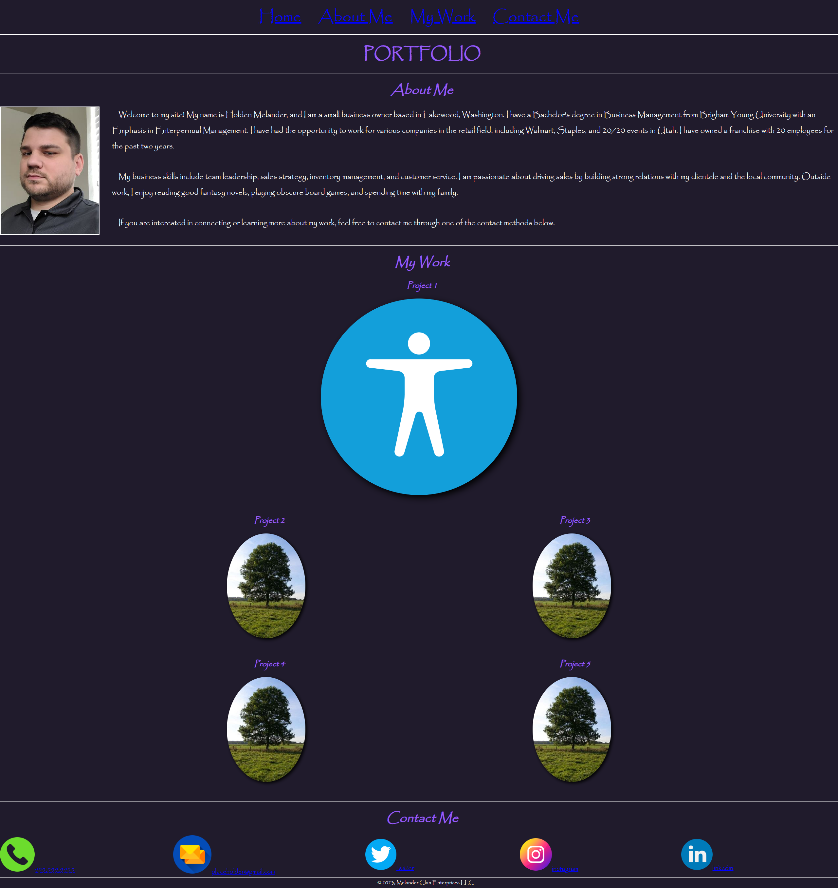

# Development Portfolio of Holden Melander

## Description

This webpage has been created to share my personal and group project with those who may show interest. As my development skills improve, so will this webpage and its layout. 

## Visuals

The following image shows the web application's appearance and functionality:

The following <a href="https://essence1987.github.io/SoloProject/">Link</a> takes you to the page.

**Note** This mockup may not fully match the current page's functionality. It is a continual work in progress, with Projects updated as they become available to the public. 

## Support
If you have issues with broken links or web accessibility issues, please send me a message at hwmelander@gmail.com.

## Contributing
This is considered my Personal Webpage, and I will not be accepting collaboration requests for this specific webpage. However, if you want to invite me to contribute to a stand-alone project, don't hesitate to contact me. You can find my contact information under the Support section.

## Authors and acknowledgment
Thank you to makeareadme.com for providing this template.

## License
N/A

## Project status
Though complete, I will continually update this webpage as I complete more projects to add to my ever-evolving portfolio.